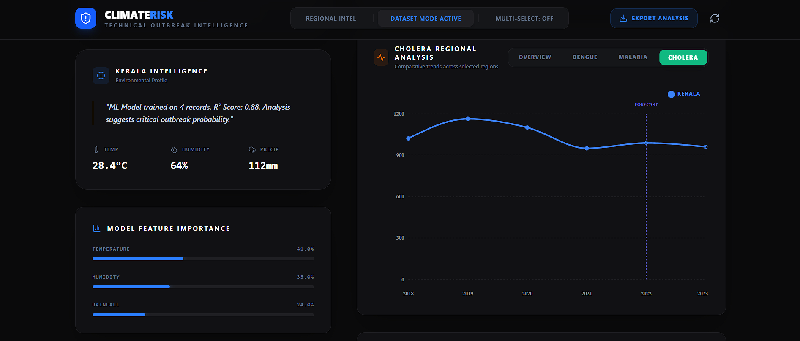
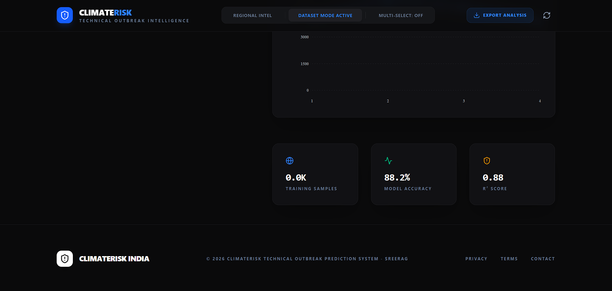

# ClimateRisk India: Technical Outbreak Intelligence

ClimateRisk India is a sophisticated outbreak prediction system that leverages environmental variables and historical data to forecast disease risks across India. Using local machine learning models (Multivariate and Simple Linear Regression), the platform analyzes temperature, humidity, and rainfall patterns to provide actionable intelligence for public health monitoring.


## 🚀 Features

- **Regional Intelligence**: Interactive map of India with multi-select capabilities to analyze specific states or compare multiple regions simultaneously.
- **ML-Driven Predictions**: Real-time risk assessment for Dengue, Malaria, and Cholera using regression models.
- **Dataset Mode**: Upload your own CSV/XLSX datasets to train the local model and generate custom insights.
- **Advanced Analytics**:
    - **Annual Outbreak Trends**: Visualizing the total burden across selected regions.
    - **Disease Comparison**: Side-by-side analysis of different outbreak profiles.
    - **Model Performance**: Verification of regression accuracy (Actual vs. Predicted).
- **Feature Importance**: Transparency into which environmental factors (Rainfall, Temp, etc.) are driving the current risk scores.
- **Data Export**: Download comprehensive risk assessment reports in CSV format.

## 🛠️ Tech Stack

- **Frontend**: React 19, Vite, TypeScript
- **Styling**: Tailwind CSS (Modern dark-themed UI)
- **Charts**: Recharts (High-performance data visualization)
- **Animations**: Motion (Smooth transitions and interactive elements)
- **Machine Learning**: 
    - `ml-regression-simple-linear`
    - `ml-regression-multivariate-linear`
- **Icons**: Lucide React
- **Data Processing**: PapaParse, XLSX

## 📦 Installation

1. Clone the repository:
   ```bash
   git clone https://github.com/your-username/climate-risk-india.git
   cd climate-risk-india


   ## 📸 Dashboard Preview

### Main Dashboard


### Disease Analysis


### Dataset Mode


### Model Performance


### Trends & Insights

